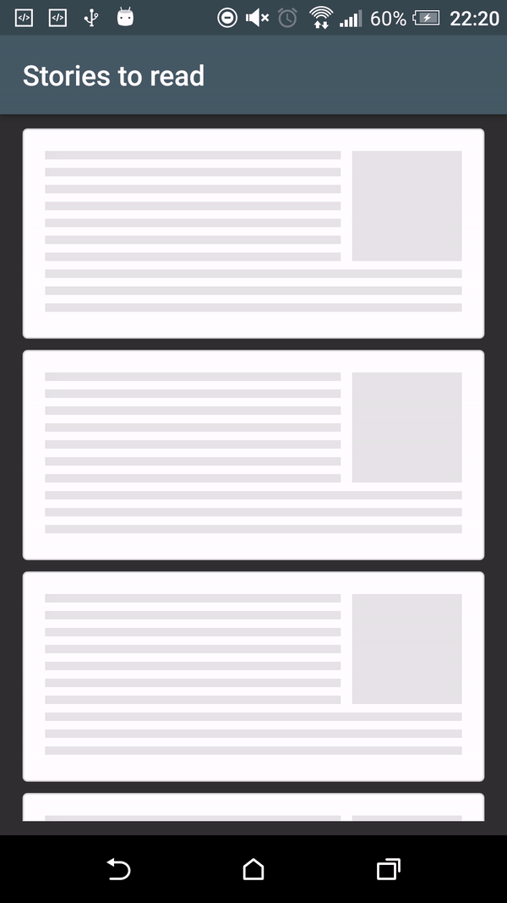
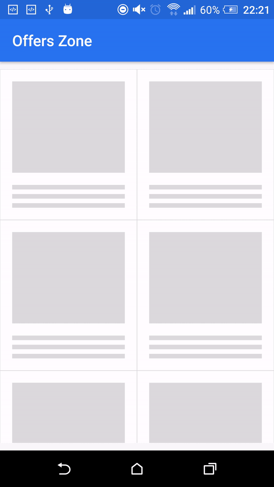

# ShimmerRecyclerView
Migrate ShimmerRecyclerView to AndroidX

Intro
------

A custom recycler view with shimmer views to indicate that views are loading. The recycler view has a built-in adapter to control the shimmer appearance and provide two methods -

* showShimmerAdapter() - set up a demo adapter a predefined number of child demo views.
* hideShimmerAdapter() - restores your adapter to show the actual child elements.

    
Demo Screen
------

There are two kinds of shimmer animation which you can see here:

1. This type of shimmer effect uses the whole ViewHolder item to animate on.

|     List Demo                |        Grid Demo              | 
| ----------------------------  | ----------------------------- | 
|  |    |

2. Here the shimmer effect only applied on for those views which background color is nontransparent.

|     List Demo                |        Grid Demo              |
| ----------------------------  | ----------------------------- |
|  |    |

Usage
--------

Define your xml as:

```xml
<com.cooltechworks.views.shimmer.ShimmerRecyclerView
        xmlns:app="http://schemas.android.com/apk/res-auto"
        android:id="@+id/shimmer_recycler_view"
        android:layout_width="match_parent"
        android:layout_height="match_parent"
        app:shimmer_demo_child_count="10"
        app:shimmer_demo_grid_child_count="2"
        app:shimmer_demo_layout="@layout/layout_demo_grid"
        app:shimmer_demo_layout_manager_type="grid"
        app:shimmer_demo_angle="20"
        />

```
where ```@layout/layout_demo_grid``` refers to your sample layout that should be shown during loading spinner. Now on your activity onCreate, initialize the shimmer as below:

```java
ShimmerRecyclerView shimmerRecycler = (ShimmerRecyclerView) findViewById(R.id.shimmer_recycler_view);
shimmerRecycler.showShimmerAdapter();
```

Adding to your project
------------------------

- Add the following configuration in your build.gradle file.

```gradle
repositories {
    jcenter()
    maven { url "https://jitpack.io" }
}

dependencies {
	implementation 'com.github.achrefadala:ShimmerRecyclerView:v1.5'
}
```

Developed By
------------

* Harish Sridharan - <harish.sridhar@gmail.com>


Used libraries
----------------

* <a href="https://github.com/team-supercharge/ShimmerLayout">ShimmerLayout</a>: the library which achieves the shimmer effect in a memory efficient way.

License
--------
The repo is released under following licenses

<a href="LICENSE.md">Apache License</a> for ShimmerRecycler<br>
<a href="https://github.com/team-supercharge/ShimmerLayout/blob/master/LICENSE.md">Apache License</a> for ShimmerLayout


